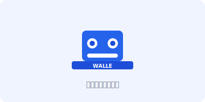

**Walle（瓦力）** 是一个基于 Next.js 14 的极简静态博客系统。所有内容以 Markdown 文件存储，构建后输出纯静态文件，可部署到 GitHub Pages 等任意托管平台。

## 功能一览

### 文章

用 Markdown 写作，支持标题、摘要、分类、标签、发布日期等元信息。代码块自动语法高亮，图片直接引用本地资源。

### 分类与标签

每篇文章可以归属一个分类、添加多个标签。系统自动生成分类页和标签页，方便读者按主题浏览。

### 归档

按年份分组展示所有文章，并提供日历视图，直观呈现每月的发文分布。

### 全文搜索

导航栏内置客户端搜索，无需服务端，可快速检索所有文章的标题、摘要和标签。

### 个人信息

支持在页面中展示头像、昵称、简介和社交链接（GitHub、微博、RSS），显示位置可灵活配置：导航栏横幅、导航栏内嵌、首页顶部或底部。

### 主题

内置主题继承机制，自定义主题只需覆盖需要差异化的组件，其余自动继承默认样式，改动最小。

### 部署

推送代码后，GitHub Actions 自动构建并发布到 GitHub Pages，全程无需手动操作。

---

## Markdown 语法示例

### 文字样式

**粗体**、*斜体*、***粗斜体***、~~删除线~~、`行内代码`

> 这是一段引用文字。
>
> 引用可以跨越多个段落，并支持 **嵌套格式**。

### 列表

无序列表：

- 苹果
- 香蕉
  - 大蕉
  - 小米蕉
- 樱桃

有序列表：

1. 第一步：安装依赖
2. 第二步：编写文章
3. 第三步：构建部署

任务列表：

- [x] 初始化项目
- [x] 配置主题
- [ ] 编写文档
- [ ] 发布上线

### 代码块

行内代码：执行 `npm run build` 构建项目。

JavaScript 代码块：

```javascript
async function fetchPosts(page = 1) {
  const res = await fetch(`/api/posts?page=${page}`);
  if (!res.ok) throw new Error('请求失败');
  return res.json();
}
```

TypeScript 代码块：

```typescript
interface Post {
  slug: string;
  title: string;
  date: string;
  tags: string[];
}

function formatDate(date: string): string {
  return new Date(date).toLocaleDateString('zh-CN');
}
```

Bash 命令：

```bash
# 安装依赖并启动开发服务器
npm install
npm run dev
```

### 表格

| 功能 | 状态 | 说明 |
|:---|:---:|---:|
| 文章列表 | ✅ | 支持分页 |
| 分类 / 标签 | ✅ | 自动聚合 |
| 全文搜索 | ✅ | 客户端 Fuse.js |
| RSS Feed | 🚧 | 计划中 |
| 评论系统 | ❌ | 暂不支持 |

### 链接与图片

[访问 GitHub](https://github.com) — 外部链接

图片（本地资源）：


### 分割线

---

### 嵌套引用

> **注意**
>
> > 嵌套引用内容
> >
> > 可以继续嵌套下去
>
> 回到第一层引用。
